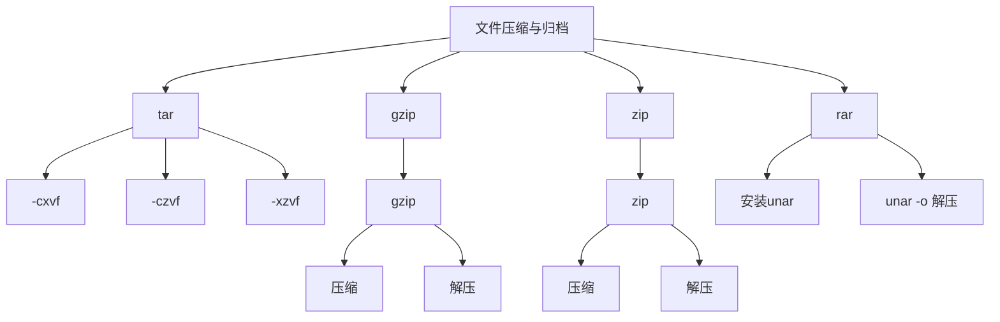

```mermaid
graph TD
    A[文件压缩与归档]
    A --> B[tar]
    A --> C[gzip]
    A --> D[zip]
    A --> E[rar]
    
    B --> B1[-cxvf]
    B --> B2[-czvf]
    B --> B3[-xzvf]
    
    C --> C1[gzip]
    C1 --> C1a[压缩]
    C1 --> C1b[解压]
    
    D --> D1[zip]
    D1 --> D1a[压缩]
    D1 --> D1b[解压]
    
    E --> E1[安装unar]
    E --> E2[unar -o 解压]

```